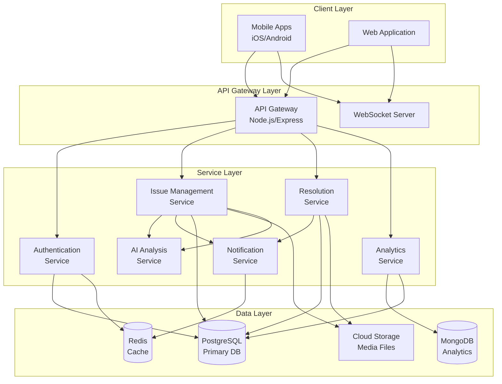

# Design Document: Citizen Issue Reporter

## Overview

The Citizen Issue Reporter is a full-stack web and mobile application that connects citizens with government authorities through a social media-inspired interface. The system architecture follows a modern microservices approach with clear separation between frontend, backend API, AI services, and data storage layers.

### Key Design Principles

1. **Mobile-First**: Responsive design optimized for mobile devices with progressive web app capabilities
2. **Scalability**: Microservices architecture to handle growing user base and data volume
3. **Real-Time**: WebSocket connections for live updates and notifications
4. **AI-Driven**: Machine learning integration for intelligent categorization and insights
5. **Security**: End-to-end encryption, role-based access control, and secure authentication
6. **Accessibility**: Multi-language support and inclusive design patterns

### Technology Stack

**Frontend:**
- React Native (mobile apps for iOS/Android)
- React.js (web application)
- Redux for state management
- Socket.io client for real-time updates
- React Native Maps for geolocation visualization

**Backend:**
- Node.js with Express.js (API Gateway)
- Python with FastAPI (AI/ML services)
- PostgreSQL (primary database)
- Redis (caching and session management)
- MongoDB (analytics and logs)

**AI/ML:**
- TensorFlow/PyTorch for image analysis
- Natural Language Processing for text categorization
- Pre-trained models for content moderation

**Infrastructure:**
- AWS S3 or Google Cloud Storage for media files
- AWS Lambda or Google Cloud Functions for serverless processing
- Docker and Kubernetes for containerization
- CDN for media delivery
- Firebase Cloud Messaging for push notifications

## Architecture

### High-Level Architecture



### Data Flow

**Issue Submission Flow:**
1. Citizen uploads issue with media through mobile/web client
2. API Gateway authenticates request and validates input
3. Media files uploaded to cloud storage, URLs returned
4. Issue data stored in PostgreSQL with media URLs
5. AI Analysis Service triggered asynchronously
6. AI categorizes issue and extracts metadata
7. Issue updated with AI-generated categories
8. Real-time notification sent via WebSocket to relevant users
9. Analytics service updates metrics

**Resolution Posting Flow:**
1. Officer posts resolution linked to an issue
2. API Gateway validates Officer permissions
3. Resolution media uploaded to cloud storage
4. Resolution data stored in PostgreSQL
5. Issue status updated to "resolved"
6. Notification sent to issue reporter and followers
7. Analytics updated with resolution metrics

## Components and Interfaces

### 1. Authentication Service

**Responsibilities:**
- User registration and login
- JWT token generation and validation
- Role-based access control
- Officer verification workflow
- Session management

**API Endpoints:**

```typescript
POST /api/auth/register
Request: {
  email: string,
  password: string,
  phone: string,
  role: "citizen" | "officer",
  name: string,
  verificationCredentials?: object // for officers
}
Response: {
  userId: string,
  message: string,
  requiresVerification: boolean
}

POST /api/auth/login
Request: {
  email: string,
  password: string
}
Response: {
  token: string,
  refreshToken: string,
  user: UserProfile
}

POST /api/auth/refresh
Request: {
  refreshToken: string
}
Response: {
  token: string
}

GET /api/auth/verify-officer/:verificationId
Response: {
  status: "pending" | "approved" | "rejected"
}
```

### 2. Issue Management Service

**Responsibilities:**
- Create, read, update, delete issues
- Media upload handling
- Geolocation processing
- Issue filtering and search
- Priority voting

**API Endpoints:**

```typescript
POST /api/issues
Request: {
  description: string,
  location: {
    latitude: number,
    longitude: number,
    address?: string
  },
  mediaFiles: File[],
  language: string
}
Response: {
  issueId: string,
  status: "pending",
  createdAt: timestamp,
  mediaUrls: string[]
}

GET /api/issues
Query Parameters: {
  location?: string,
  category?: string[],
  status?: string[],
  timeRange?: string,
  page: number,
  limit: number
}
Response: {
  issues: Issue[],
  totalCount: number,
  page: number
}

GET /api/issues/:issueId
Response: Issue

POST /api/issues/:issueId/vote
Response: {
  voteCount: number
}

PATCH /api/issues/:issueId/status
Request: {
  status: "pending" | "in-progress" | "resolved"
}
Response: Issue
```

### 3. AI Analysis Service

**Responsibilities:**
- Image and video content analysis
- Text description NLP processing
- Automatic categorization
- Urgency detection
- Content moderation

**Internal API:**

```python
def analyze_issue(issue_data: IssueData) -> AnalysisResult:
    """
    Analyzes issue content and returns categorization
    
    Args:
        issue_data: Contains description, media_urls, location
    
    Returns:
        AnalysisResult with categories, urgency_score, keywords
    """
    pass

def moderate_content(content: Content) -> ModerationResult:
    """
    Checks content for policy violations
    
    Returns:
        ModerationResult with is_appropriate flag and reasons
    """
    pass
```

**Categories:**
- Infrastructure (roads, bridges, buildings)
- Sanitation (waste management, cleanliness)
- Safety (street lights, security concerns)
- Utilities (water, electricity, gas)
- Environment (pollution, tree maintenance)
- Traffic (congestion, signals, parking)
- Health (public health hazards)
- Other

### 4. Resolution Service

**Responsibilities:**
- Create and manage resolutions
- Link resolutions to issues
- Update issue status
- Track resolution metrics

**API Endpoints:**

```typescript
POST /api/resolutions
Request: {
  issueId: string,
  description: string,
  mediaFiles: File[],
  language: string
}
Response: {
  resolutionId: string,
  issueId: string,
  createdAt: timestamp,
  mediaUrls: string[]
}

GET /api/resolutions/:resolutionId
Response: Resolution

GET /api/issues/:issueId/resolutions
Response: Resolution[]
```

### 5. Analytics Service

**Responsibilities:**
- Aggregate issue and resolution metrics
- Generate dashboard data
- Calculate resolution time statistics
- Track trends over time

**API Endpoints:**

```typescript
GET /api/analytics/overview
Query Parameters: {
  startDate?: date,
  endDate?: date,
  location?: string
}
Response: {
  totalIssues: number,
  resolvedIssues: number,
  pendingIssues: number,
  inProgressIssues: number,
  averageResolutionTime: number, // in hours
  issuesByCategory: CategoryCount[],
  issuesByLocation: LocationCount[],
  trendData: TrendPoint[]
}

GET /api/analytics/category/:category
Response: {
  totalIssues: number,
  resolvedPercentage: number,
  averageResolutionTime: number,
  topLocations: LocationCount[]
}
```

### 6. Notification Service

**Responsibilities:**
- Send push notifications
- Manage WebSocket connections
- Email notifications
- User notification preferences

**WebSocket Events:**

```typescript
// Client subscribes to updates
socket.emit('subscribe', { issueIds: string[] })

// Server sends updates
socket.on('issue_updated', (data: {
  issueId: string,
  status: string,
  updatedAt: timestamp
}))

socket.on('resolution_posted', (data: {
  issueId: string,
  resolutionId: string,
  officerName: string
}))

socket.on('new_issue', (data: {
  issue: Issue
}))
```

### 7. Media Storage Service

**Responsibilities:**
- Upload media to cloud storage
- Generate thumbnails and optimized versions
- Serve media through CDN
- Manage storage quotas

**Interface:**

```typescript
async function uploadMedia(
  file: File,
  userId: string,
  type: "issue" | "resolution"
): Promise<MediaUploadResult> {
  // Validate file type and size
  // Scan for malicious content
  // Upload to cloud storage
  // Generate thumbnail
  // Return URLs
}

async function getMediaUrl(
  mediaId: string,
  size: "thumbnail" | "medium" | "full"
): Promise<string> {
  // Return CDN URL for requested size
}
```

## Data Models

### User Model

```typescript
interface User {
  userId: string;
  email: string;
  passwordHash: string;
  phone: string;
  name: string;
  role: "citizen" | "officer";
  profilePicture?: string;
  preferredLanguage: string;
  location?: {
    city: string;
    state: string;
  };
  verificationStatus?: "pending" | "approved" | "rejected"; // for officers
  createdAt: timestamp;
  updatedAt: timestamp;
}
```

### Issue Model

```typescript
interface Issue {
  issueId: string;
  reporterId: string; // User ID
  description: string;
  originalLanguage: string;
  location: {
    latitude: number;
    longitude: number;
    address: string;
    city: string;
    state: string;
  };
  mediaUrls: string[]; // URLs to photos/videos
  voiceNoteUrl?: string;
  categories: string[]; // AI-generated
  status: "pending" | "in-progress" | "resolved";
  urgencyScore: number; // 0-100, AI-generated
  priorityVotes: number;
  viewCount: number;
  createdAt: timestamp;
  updatedAt: timestamp;
  resolvedAt?: timestamp;
  aiMetadata: {
    keywords: string[];
    detectedObjects: string[];
    confidence: number;
  };
}
```

### Resolution Model

```typescript
interface Resolution {
  resolutionId: string;
  issueId: string;
  officerId: string; // User ID
  description: string;
  originalLanguage: string;
  mediaUrls: string[]; // Photos showing resolution
  createdAt: timestamp;
  updatedAt: timestamp;
}
```

### Vote Model

```typescript
interface Vote {
  voteId: string;
  issueId: string;
  userId: string;
  createdAt: timestamp;
}
```

### Notification Model

```typescript
interface Notification {
  notificationId: string;
  userId: string;
  type: "issue_updated" | "resolution_posted" | "status_changed";
  title: string;
  message: string;
  relatedIssueId?: string;
  relatedResolutionId?: string;
  read: boolean;
  createdAt: timestamp;
}
```

### Analytics Aggregation Model (MongoDB)

```typescript
interface DailyMetrics {
  date: date;
  location: {
    city: string;
    state: string;
  };
  issuesCreated: number;
  issuesResolved: number;
  categoryBreakdown: {
    [category: string]: number;
  };
  averageResolutionTime: number;
  totalViews: number;
  totalVotes: number;
}
```

## Correctness Properties

*A property is a characteristic or behavior that should hold true across all valid executions of a system—essentially, a formal statement about what the system should do. Properties serve as the bridge between human-readable specifications and machine-verifiable correctness guarantees.*


### Property 1: Registration requires all mandatory fields
*For any* registration attempt, if any required field (email, password, phone, role) is missing, the registration should be rejected, and if all fields are present, the registration should succeed.
**Validates: Requirements 1.1**

### Property 2: Officer accounts require verification
*For any* Officer registration, the created account should have verification status set to "pending" until approved by an administrator.
**Validates: Requirements 1.2**

### Property 3: Valid credentials grant authentication
*For any* registered user, logging in with their correct credentials should return a valid JWT token and user profile.
**Validates: Requirements 1.3**

### Property 4: Invalid credentials are rejected
*For any* login attempt with incorrect credentials (wrong password, non-existent email, or mismatched combinations), the system should reject the authentication and return an error.
**Validates: Requirements 1.4**

### Property 5: Passwords are never stored in plaintext
*For any* user account, querying the database directly should never return the original password—only a hashed version.
**Validates: Requirements 1.5**

### Property 6: Issue creation accepts multiple media types
*For any* issue submission with valid media files (photos, videos, voice notes) and text description, the system should accept and store all provided media.
**Validates: Requirements 2.1**

### Property 7: Issues capture geolocation automatically
*For any* issue created with location permission granted, the issue should have latitude and longitude coordinates populated.
**Validates: Requirements 2.2**

### Property 8: Invalid media uploads are rejected
*For any* media upload that violates file type restrictions or size limits, the system should reject the upload and return an appropriate error.
**Validates: Requirements 2.3**

### Property 9: Issue creation sets required metadata
*For any* created issue, it should have a unique identifier, timestamp, and initial status of "pending".
**Validates: Requirements 2.4, 2.5**

### Property 10: Media upload and retrieval round-trip
*For any* valid media file uploaded to the system, retrieving it by its URL should return content that matches the original upload.
**Validates: Requirements 2.6**

### Property 11: AI analysis is triggered for all issues
*For any* submitted issue, the AI analyzer should process it and populate AI metadata fields (categories, urgency score, keywords).
**Validates: Requirements 3.1, 3.5**

### Property 12: Issues always have at least one category
*For any* issue after AI analysis, it should have at least one category assigned (including "uncategorized" as a fallback).
**Validates: Requirements 3.2, 3.3**

### Property 13: AI extracts structured metadata
*For any* analyzed issue, the AI metadata should include an urgency score (0-100) and a list of extracted keywords.
**Validates: Requirements 3.4**

### Property 14: Resolution creation includes required data
*For any* resolution posted by an Officer, it should include the Officer's ID, timestamp, description, and media URLs.
**Validates: Requirements 4.1, 4.3**

### Property 15: Resolutions update issue status
*For any* issue that receives a resolution, its status should be updated to "resolved" and the resolution should be linked to the issue.
**Validates: Requirements 4.2**

### Property 16: Only Officers can post resolutions
*For any* resolution posting attempt by a Citizen (non-Officer), the system should reject the request with an authorization error.
**Validates: Requirements 4.4**

### Property 17: Feed includes issues and resolutions
*For any* issue that has a resolution, querying the feed should return both the issue and its linked resolution.
**Validates: Requirements 4.5**

### Property 18: Feed displays items in reverse chronological order
*For any* set of issues created at different times, the feed should return them with the most recent first.
**Validates: Requirements 5.1**

### Property 19: Pagination returns distinct pages
*For any* feed query with pagination, requesting page N and page N+1 should return different sets of items with no overlap.
**Validates: Requirements 5.2**

### Property 20: Issue feed items contain required fields
*For any* issue in the feed response, it should include media URLs, description, location, categories, timestamp, and status.
**Validates: Requirements 5.3**

### Property 21: Resolution feed items contain required fields
*For any* resolution in the feed response, it should include the linked issue ID, media URLs, description, Officer name, and timestamp.
**Validates: Requirements 5.4**

### Property 22: Location filter returns only matching issues
*For any* location filter applied to the feed, all returned issues should have locations within the specified geographic area.
**Validates: Requirements 6.1**

### Property 23: Category filter returns only matching issues
*For any* category filter applied to the feed, all returned issues should have at least one category that matches the filter.
**Validates: Requirements 6.2**

### Property 24: Time filter returns only issues in range
*For any* time range filter applied to the feed, all returned issues should have creation timestamps within the specified range.
**Validates: Requirements 6.3**

### Property 25: Status filter returns only matching issues
*For any* status filter applied to the feed, all returned issues should have a status that matches one of the selected status values.
**Validates: Requirements 6.4**

### Property 26: Multiple filters apply AND logic
*For any* combination of filters (location, category, time, status), all returned issues should satisfy every applied filter simultaneously.
**Validates: Requirements 6.5**

### Property 27: Analytics reflect actual issue counts
*For any* set of created issues, the analytics total count should exactly match the number of issues in the database.
**Validates: Requirements 7.1, 7.7**

### Property 28: Analytics aggregate by status correctly
*For any* set of issues with various statuses, the analytics should report counts for resolved, pending, and in-progress that sum to the total count.
**Validates: Requirements 7.2**

### Property 29: Analytics aggregate by category correctly
*For any* set of issues with various categories, the sum of issues across all category counts should equal the total number of issues.
**Validates: Requirements 7.3**

### Property 30: Analytics aggregate by location correctly
*For any* set of issues across different locations, the sum of issues across all location counts should equal the total number of issues.
**Validates: Requirements 7.4**

### Property 31: Average resolution time calculation
*For any* set of resolved issues with known resolution times, the analytics should calculate the average resolution time correctly (sum of times / count).
**Validates: Requirements 7.5**

### Property 32: Analytics respect date range filters
*For any* date range filter applied to analytics, only issues created within that range should be included in the calculations.
**Validates: Requirements 7.6**

### Property 33: Language selection affects UI responses
*For any* supported language selected by a user, API responses should include UI strings in that language.
**Validates: Requirements 8.2**

### Property 34: Language preference persists across sessions
*For any* user who changes their language preference, logging out and back in should preserve the selected language.
**Validates: Requirements 8.3**

### Property 35: Content preserves original language
*For any* issue or resolution created in a specific language, the original language should be stored and the content should be viewable in that language.
**Validates: Requirements 8.4**

### Property 36: Translated content is marked
*For any* content requested in a language different from its original, the response should include a flag indicating the content has been translated.
**Validates: Requirements 8.5**

### Property 37: Manual location entry is accepted
*For any* issue created with manually entered location data (without automatic geolocation), the system should accept and store the provided location.
**Validates: Requirements 9.3**

### Property 38: Coordinates are reverse-geocoded
*For any* issue with latitude and longitude coordinates, the system should provide a human-readable address through reverse geocoding.
**Validates: Requirements 9.4**

### Property 39: View counts increment on access
*For any* issue, each time it is viewed, the view count should increase by 1.
**Validates: Requirements 10.1**

### Property 40: Citizens can vote on issues
*For any* issue and any Citizen, the Citizen should be able to cast a priority vote, and the vote count should increase by 1.
**Validates: Requirements 10.2, 10.3**

### Property 41: Duplicate votes are prevented
*For any* Citizen who has already voted on an issue, attempting to vote again should not increase the vote count.
**Validates: Requirements 10.4**

### Property 42: Issues include engagement metrics
*For any* issue in API responses, it should include view count and priority vote count fields.
**Validates: Requirements 10.5**

### Property 43: Status changes trigger notifications
*For any* issue whose status changes, all users who have interacted with that issue (reporter, voters, commenters) should receive a notification.
**Validates: Requirements 11.1**

### Property 44: Resolutions trigger reporter notifications
*For any* resolution posted to an issue, the original issue reporter should receive a notification about the resolution.
**Validates: Requirements 11.2**

### Property 45: Media available in multiple sizes
*For any* uploaded media file, the system should provide URLs for thumbnail, medium, and full-size versions.
**Validates: Requirements 12.2**

### Property 46: Thumbnails generated automatically
*For any* photo or video uploaded, the system should automatically generate a thumbnail image.
**Validates: Requirements 12.3**

### Property 47: Media scanned for malicious content
*For any* media upload, the system should invoke a security scanning function before accepting the file.
**Validates: Requirements 12.4**

### Property 48: Storage quotas are enforced
*For any* user who has reached their storage quota, attempting to upload additional media should be rejected with a quota exceeded error.
**Validates: Requirements 12.5**

### Property 49: Search covers multiple fields
*For any* search query, the system should search across issue descriptions, locations, and categories, returning issues that match in any of these fields.
**Validates: Requirements 13.1**

### Property 50: Partial word matching in search
*For any* search query containing a partial word, the system should return issues containing words that start with or contain that partial string.
**Validates: Requirements 13.3**

### Property 51: PII is encrypted at rest
*For any* user record in the database, personally identifiable information fields (email, phone, name) should be stored in encrypted form.
**Validates: Requirements 14.2**

### Property 52: Account deletion removes personal data
*For any* user who deletes their account, all personal data should be marked for deletion and removed from the system.
**Validates: Requirements 14.3**

### Property 53: Users can export their data
*For any* user requesting a data export, the system should provide a downloadable file containing all their issues, resolutions, and profile data.
**Validates: Requirements 14.5**

### Property 54: Sensitive data access is logged
*For any* access to sensitive user data (by admins or system processes), an audit log entry should be created with timestamp, accessor ID, and data accessed.
**Validates: Requirements 14.6**

### Property 55: Flagged content enters moderation queue
*For any* content flagged as inappropriate, it should appear in the moderation queue with the flag reason and timestamp.
**Validates: Requirements 15.1**

### Property 56: Admins can remove content
*For any* content in the moderation queue, an administrator should be able to remove it, making it no longer visible in the feed.
**Validates: Requirements 15.2**

### Property 57: Content removal notifies author
*For any* content removed by moderation, the user who created that content should receive a notification explaining the removal.
**Validates: Requirements 15.3**

### Property 58: AI flags inappropriate content
*For any* issue or resolution created, the AI moderation system should analyze it and flag content that violates policies.
**Validates: Requirements 15.4**

### Property 59: Moderation actions are logged
*For any* moderation action (flagging, removal, approval), the system should create an audit log entry with the moderator ID, action type, content ID, and timestamp.
**Validates: Requirements 15.5**

## Error Handling

### Authentication Errors
- **Invalid credentials**: Return 401 Unauthorized with clear error message
- **Expired token**: Return 401 with token_expired error code
- **Insufficient permissions**: Return 403 Forbidden with permission details
- **Account not verified**: Return 403 with verification_required error code

### Validation Errors
- **Missing required fields**: Return 400 Bad Request with list of missing fields
- **Invalid file type**: Return 400 with supported_types list
- **File too large**: Return 413 Payload Too Large with max_size information
- **Invalid coordinates**: Return 400 with valid range information
- **Storage quota exceeded**: Return 413 with quota details

### Resource Errors
- **Issue not found**: Return 404 Not Found
- **Resolution not found**: Return 404 Not Found
- **User not found**: Return 404 Not Found
- **Media not found**: Return 404 Not Found

### Service Errors
- **AI analysis failure**: Log error, assign "uncategorized", continue processing
- **Media upload failure**: Return 503 Service Unavailable, suggest retry
- **Database connection failure**: Return 503, implement retry logic with exponential backoff
- **External API failure** (geocoding, translation): Log error, use fallback or cached data

### Rate Limiting
- **Too many requests**: Return 429 Too Many Requests with retry_after header
- **Implement rate limits**: 100 requests per minute per user for API calls
- **Media upload limits**: 10 uploads per hour per user

### Error Response Format

```typescript
interface ErrorResponse {
  error: {
    code: string;
    message: string;
    details?: object;
    timestamp: string;
  };
}
```

## Testing Strategy

### Dual Testing Approach

The system will employ both unit testing and property-based testing to ensure comprehensive coverage:

**Unit Tests** focus on:
- Specific examples demonstrating correct behavior
- Edge cases (empty inputs, boundary values, special characters)
- Error conditions and exception handling
- Integration points between services
- Mock external dependencies (cloud storage, AI services)

**Property-Based Tests** focus on:
- Universal properties that hold for all inputs
- Comprehensive input coverage through randomization
- Invariants that must be maintained
- Round-trip properties (upload/download, serialize/deserialize)
- Relationship properties between components

### Property-Based Testing Configuration

**Framework Selection:**
- **JavaScript/TypeScript**: fast-check library
- **Python**: Hypothesis library

**Test Configuration:**
- Minimum 100 iterations per property test
- Each property test references its design document property
- Tag format: `Feature: citizen-issue-reporter, Property {number}: {property_text}`

**Example Property Test Structure:**

```typescript
// Feature: citizen-issue-reporter, Property 9: Issue creation sets required metadata
describe('Issue Creation Metadata', () => {
  it('should set unique ID, timestamp, and pending status for all issues', () => {
    fc.assert(
      fc.property(
        fc.record({
          description: fc.string({ minLength: 1 }),
          location: fc.record({
            latitude: fc.double({ min: -90, max: 90 }),
            longitude: fc.double({ min: -180, max: 180 })
          }),
          reporterId: fc.uuid()
        }),
        async (issueData) => {
          const issue = await createIssue(issueData);
          
          expect(issue.issueId).toBeDefined();
          expect(issue.createdAt).toBeInstanceOf(Date);
          expect(issue.status).toBe('pending');
          
          // Verify uniqueness by creating another issue
          const issue2 = await createIssue(issueData);
          expect(issue2.issueId).not.toBe(issue.issueId);
        }
      ),
      { numRuns: 100 }
    );
  });
});
```

### Test Coverage Goals

- **Unit test coverage**: Minimum 80% code coverage
- **Property test coverage**: All 59 correctness properties implemented
- **Integration test coverage**: All API endpoints tested
- **End-to-end tests**: Critical user flows (issue creation, resolution posting, feed viewing)

### Testing Environments

- **Local**: Docker Compose with all services
- **CI/CD**: Automated test runs on every commit
- **Staging**: Full integration testing with production-like data
- **Production**: Monitoring and alerting for errors

### Performance Testing

- **Load testing**: Simulate 10,000 concurrent users
- **Stress testing**: Find breaking points for each service
- **Media upload testing**: Test with various file sizes up to limits
- **Database query optimization**: Ensure feed queries under 100ms
- **AI analysis latency**: Target under 2 seconds per issue

### Security Testing

- **Penetration testing**: Regular security audits
- **SQL injection testing**: Automated scanning
- **XSS prevention**: Input sanitization testing
- **Authentication testing**: Token expiration and refresh flows
- **Authorization testing**: Role-based access control verification
- **Media scanning**: Malicious file upload attempts

## Implementation Notes

### Phased Rollout

**Phase 1: MVP (Months 1-3)**
- User authentication (Citizens and Officers)
- Basic issue reporting (photos and text)
- Simple feed interface
- Basic categorization (manual or simple keyword-based)
- Mobile-responsive web app

**Phase 2: Enhanced Features (Months 4-6)**
- AI-powered categorization
- Advanced filtering system
- Analytics dashboard
- Video and voice note support
- Push notifications

**Phase 3: Scale and Polish (Months 7-9)**
- Multi-language support
- Performance optimization
- Advanced search
- Content moderation tools
- Mobile native apps (iOS/Android)

### Scalability Considerations

- **Database sharding**: Partition by geographic region
- **CDN for media**: Reduce latency for media delivery
- **Caching strategy**: Redis for frequently accessed data
- **Async processing**: Queue-based architecture for AI analysis
- **Horizontal scaling**: Kubernetes for service orchestration
- **Database read replicas**: Separate read and write operations

### Monitoring and Observability

- **Application metrics**: Response times, error rates, throughput
- **Business metrics**: Issues created, resolution rate, user engagement
- **Infrastructure metrics**: CPU, memory, disk, network usage
- **Logging**: Centralized logging with ELK stack or similar
- **Alerting**: PagerDuty or similar for critical issues
- **Tracing**: Distributed tracing for request flows across services
