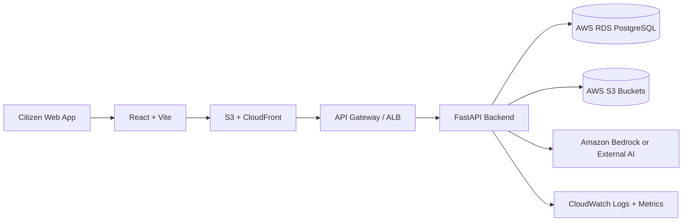

# FixIt Hub – AI-Powered Civic Intelligence Platform

## Requirements Specification Document v1.0

## Table of Contents

- [1. Introduction](#1-introduction)
- [2. Problem Context](#2-problem-context)
- [3. Solution Overview](#3-solution-overview)
- [3.4 Architecture Snapshot](#34-architecture-snapshot)
- [4. Functional Requirements](#4-functional-requirements)
- [5. Non-Functional Requirements](#5-non-functional-requirements)
- [6. System Constraints](#6-system-constraints)
- [7. Assumptions](#7-assumptions)
- [8. Acceptance Criteria](#8-acceptance-criteria)
- [9. Future Enhancements](#9-future-enhancements)
- [10. Success Metrics](#10-success-metrics)
- [11. Risk Assessment](#11-risk-assessment)
- [12. Testing Requirements](#12-testing-requirements)
- [13. Documentation Requirements](#13-documentation-requirements)
- [14. Training Requirements](#14-training-requirements)
- [15. Deployment Strategy](#15-deployment-strategy)
- [16. Maintenance & Support](#16-maintenance--support)
- [17. Compliance & Standards](#17-compliance--standards)
- [18. Glossary](#18-glossary)
- [19. Appendix A: Requirement Traceability Matrix](#19-appendix-a-requirement-traceability-matrix)
- [20. Appendix B: API Endpoint Summary](#20-appendix-b-api-endpoint-summary)
- [21. Appendix C: Database Tables Summary](#21-appendix-c-database-tables-summary)
- [22. Appendix D: Risk Score Calculation Example](#22-appendix-d-risk-score-calculation-example)
- [23. Document Information](#23-document-information)
- [24. Document Revision History](#24-document-revision-history)
- [25. References](#25-references)

---

## 1. Introduction

### 1.1 Document Purpose

This document specifies the functional and non-functional requirements for the FixIt Hub platform, an AI-powered civic intelligence system designed for India. It serves as the authoritative reference for development, testing, and validation of the system.

### 1.2 Document Scope

This requirements specification covers:

- Functional requirements for all system modules
- Non-functional requirements including performance, security, and scalability
- System constraints and assumptions
- Acceptance criteria for validation
- Future enhancement roadmap

### 1.3 Intended Audience

- Development team
- Quality assurance team
- Project stakeholders
- Government officials
- Hackathon judges and evaluators

### 1.4 Document Conventions

- **FR-X**: Functional Requirement
- **NFR-X**: Non-Functional Requirement
- **CON-X**: System Constraint
- **ASM-X**: System Assumption
- **AC-X**: Acceptance Criterion

> **Priority Levels**:
>
> - **P0**: Critical - Must have for MVP
> - **P1**: High - Required for production
> - **P2**: Medium - Important but can be deferred
> - **P3**: Low - Nice to have

---

## 2. Problem Context

### 2.1 Current State Analysis

India's civic infrastructure complaint management systems face critical challenges:

- **Fragmentation**: Multiple disconnected systems across municipalities with no centralized intelligence or data sharing.
- **Reactive Governance**: Authorities respond to complaints after they escalate, lacking predictive indicators for proactive intervention.
- **Language Barriers**: Existing systems primarily support English and Hindi, excluding citizens who speak other regional languages.
- **Lack of Transparency**: Citizens have limited visibility into resolution progress, leading to distrust and repeated complaints.
- **No Analytics**: Raw complaint data is not transformed into actionable insights, risk indicators, or trend analysis.
- **Poor Accountability**: No structured mechanism to verify resolution quality or allow citizens to dispute inadequate fixes.

### 2.2 Impact of Current Problems

- Delayed infrastructure repairs leading to safety hazards
- Citizen frustration and reduced civic engagement
- Inefficient resource allocation by government departments
- Inability to identify and prioritize high-risk areas
- Lack of data-driven decision making for urban planning

### 2.3 Target Users

**Primary Users**:

- **Citizens**: Report issues, track status, reopen if unresolved
- **Government Officers**: Resolve issues, upload proof, manage workload
- **Administrators**: Generate reports, manage users, monitor system health

**Secondary Users**:

- **Policy Makers**: Access analytics and reports for decision making
- **Urban Planners**: Use historical data for infrastructure planning
- **Public**: View aggregated statistics and reports

---

## 3. Solution Overview

### 3.1 Proposed Solution

FixIt Hub is a cloud-native, AI-powered civic intelligence platform that:

1. **Centralizes** all civic infrastructure complaints in a single system
2. **Democratizes** participation through multilingual support (22+ Indian languages)
3. **Automates** issue classification and translation using AI
4. **Transforms** raw complaints into structured analytics and risk indicators
5. **Enables** transparent resolution tracking with proof-based verification
6. **Empowers** citizens with controlled reopen capabilities
7. **Generates** executive-ready AI summaries for decision makers
8. **Scales** nationally using AWS cloud infrastructure

### 3.2 Key Innovations

> - **AI-Powered Multilingual Processing**: Breaks language barriers for inclusive participation
> - **Predictive Risk Scoring**: Identifies emerging infrastructure stress zones before critical failure
> - **Controlled Transparency**: Balances citizen accountability with spam prevention
> - **Executive Intelligence**: Transforms data into actionable insights for governance
> - **Proof-Based Resolution**: Ensures accountability and quality of fixes

### 3.3 Technology Foundation

> - **Frontend**: React + Vite for responsive web interface
> - **Backend**: FastAPI (Python) for high-performance API layer
> - **Database**: AWS RDS PostgreSQL for structured data
> - **Storage**: AWS S3 for images and documents
> - **AI**: Amazon Bedrock or external AI APIs for intelligent processing
> - **Infrastructure**: AWS cloud-native architecture with auto-scaling

### 3.4 Architecture Snapshot



---

## 4. Functional Requirements

### 4.1 User Management Module

#### 4.1.1 User Registration

**FR-1.1** [P0] The system shall allow citizens to register using email and password.

**FR-1.2** [P0] The system shall require the following fields during registration:

- Email address (unique)
- Phone number (optional, unique if provided)
- Full name
- Password (minimum 8 characters)

**FR-1.3** [P1] The system shall validate email format and uniqueness before registration.

**FR-1.4** [P1] The system shall hash passwords using bcrypt with cost factor 12 before storage.

**FR-1.5** [P2] The system shall send email verification link upon registration.

**FR-1.6** [P1] The system shall allow government officers to register with additional fields:

- Department
- Ward assignment
- Government email domain

**FR-1.7** [P1] The system shall require admin approval for officer accounts before activation.

#### 4.1.2 User Authentication

**FR-1.8** [P0] The system shall authenticate users using email and password.

**FR-1.9** [P0] The system shall issue JWT access tokens with 15-minute expiry upon successful login.

**FR-1.10** [P0] The system shall issue JWT refresh tokens with 7-day expiry for token renewal.

**FR-1.11** [P1] The system shall support token refresh without requiring re-authentication.

**FR-1.12** [P1] The system shall invalidate tokens upon user logout.

**FR-1.13** [P2] The system shall implement account lockout after 5 failed login attempts within 15 minutes.

**FR-1.14** [P2] The system shall provide password reset functionality via email.

#### 4.1.3 Role-Based Access Control

**FR-1.15** [P0] The system shall support three user roles:

- **Citizen**: Can report and reopen issues
- **Officer**: Can resolve issues and view analytics
- **Admin**: Full system access including user management

**FR-1.16** [P0] The system shall enforce role-based permissions on all API endpoints.

**FR-1.17** [P1] The system shall display verified badge for approved government officers.

**FR-1.18** [P1] The system shall restrict issue resolution to Officer and Admin roles only.

**FR-1.19** [P1] The system shall restrict report generation to Admin role only.

**FR-1.20** [P1] The system shall allow citizens to view only their own reported issues.

**FR-1.21** [P1] The system shall allow officers to view all issues in their assigned ward.

---

### 4.2 Issue Reporting Module

#### 4.2.1 Issue Creation

**FR-2.1** [P0] The system shall allow authenticated users to create new issues.

**FR-2.2** [P0] The system shall require the following fields for issue creation:

- Title (10-200 characters)
- Description (20-2000 characters)
- Latitude and longitude coordinates
- Image upload (optional but recommended)

**FR-2.3** [P0] The system shall accept image uploads in JPEG and PNG formats only.

**FR-2.4** [P0] The system shall enforce maximum image size of 5MB.

**FR-2.5** [P1] The system shall store uploaded images in AWS S3 with unique identifiers.

**FR-2.6** [P1] The system shall generate presigned URLs for secure image uploads.

**FR-2.7** [P1] The system shall automatically extract and store the ward/zone based on coordinates.

**FR-2.8** [P2] The system shall perform reverse geocoding to obtain human-readable address.

**FR-2.9** [P0] The system shall record the original language of submission.

**FR-2.10** [P0] The system shall assign initial status as "OPEN" upon issue creation.

**FR-2.11** [P0] The system shall generate unique UUID for each issue.

**FR-2.12** [P1] The system shall record timestamp of issue creation.

#### 4.2.2 Map-Based Location Tagging

**FR-2.13** [P0] The system shall provide interactive map interface for location selection.

**FR-2.14** [P1] The system shall support GPS-based auto-detection of user location.

**FR-2.15** [P0] The system shall allow manual pin placement on map.

**FR-2.16** [P1] The system shall display selected coordinates in latitude/longitude format.

**FR-2.17** [P2] The system shall show nearby landmarks for location confirmation.

#### 4.2.3 Multilingual Support

**FR-2.18** [P0] The system shall support issue submission in 22+ Indian languages including:

- Hindi, Bengali, Telugu, Marathi, Tamil, Gujarati, Urdu, Kannada, Odia, Malayalam, Punjabi, Assamese, English

**FR-2.19** [P0] The system shall detect the language of submitted description.

**FR-2.20** [P0] The system shall store original description in submitted language.

**FR-2.21** [P1] The system shall provide language selector in UI for input.

#### 4.2.4 Issue Listing and Filtering

**FR-2.22** [P0] The system shall display list of issues with pagination (20 items per page).

**FR-2.23** [P0] The system shall support filtering by:

- Status (OPEN, IN_PROGRESS, RESOLVED, REOPENED, CLOSED)
- Category
- Ward
- Date range

**FR-2.24** [P1] The system shall support sorting by:

- Created date (ascending/descending)
- Updated date
- Status

**FR-2.25** [P1] The system shall display issue preview with:

- Title
- Category
- Status
- Ward
- Created date
- Thumbnail image

**FR-2.26** [P1] The system shall provide search functionality by title or description.

**FR-2.27** [P1] The system shall allow citizens to filter issues by "My Issues".

**FR-2.28** [P1] The system shall allow officers to filter issues by "Assigned to Me".

---

### 4.3 AI Processing Module

#### 4.3.1 Multilingual Translation

**FR-3.1** [P0] The system shall automatically translate non-English issue descriptions to English using AI.

**FR-3.2** [P0] The system shall store translated text in separate field while preserving original.

**FR-3.3** [P1] The system shall process translation asynchronously after issue creation.

**FR-3.4** [P1] The system shall use Amazon Bedrock or external AI API for translation.

**FR-3.5** [P1] The system shall preserve technical terms and location names during translation.

**FR-3.6** [P1] The system shall implement retry logic (3 attempts) for translation failures.

**FR-3.7** [P1] The system shall flag issues for manual review if translation fails after retries.

#### 4.3.2 Automatic Issue Classification

**FR-3.8** [P0] The system shall automatically classify issues into predefined categories using AI.

**FR-3.9** [P0] The system shall support the following categories:

- Pothole
- Garbage/Waste Management
- Water Leakage/Supply
- Electrical/Streetlight
- Road Damage
- Drainage/Sewage
- Other

**FR-3.10** [P0] The system shall compute and store confidence score (0-1) for classification.

**FR-3.11** [P1] The system shall auto-assign category if confidence score > 0.8.

**FR-3.12** [P1] The system shall suggest category for officer confirmation if confidence is 0.5-0.8.

**FR-3.13** [P1] The system shall assign "Other" category if confidence < 0.5.

**FR-3.14** [P1] The system shall allow officers to manually override AI classification.

**FR-3.15** [P1] The system shall process classification asynchronously after translation.

**FR-3.16** [P1] The system shall mark issue as "ai_processed" upon successful AI processing.

#### 4.3.3 AI Fallback Handling

**FR-3.17** [P1] The system shall continue operation if AI service is unavailable.

**FR-3.18** [P1] The system shall queue failed AI requests for retry when service recovers.

**FR-3.19** [P1] The system shall log all AI processing failures to CloudWatch.

**FR-3.20** [P2] The system shall send alerts if AI failure rate exceeds 10%.

---

### 4.4 Issue Lifecycle Management

#### 4.4.1 Status States

**FR-4.1** [P0] The system shall support the following issue status states:

- **OPEN**: Newly reported, awaiting assignment
- **IN_PROGRESS**: Officer assigned, work in progress
- **RESOLVED**: Marked complete with proof
- **REOPENED**: Citizen disputed resolution
- **CLOSED**: Final closure after reopen limit

**FR-4.2** [P0] The system shall initialize all new issues with status "OPEN".

**FR-4.3** [P1] The system shall allow officers to update status to "IN_PROGRESS".

**FR-4.4** [P0] The system shall transition status to "RESOLVED" upon officer resolution.

**FR-4.5** [P0] The system shall transition status to "REOPENED" when citizen reopens.

**FR-4.6** [P1] The system shall transition status to "CLOSED" when reopen limit is reached.

**FR-4.7** [P1] The system shall record timestamp for each status change.

**FR-4.8** [P1] The system shall maintain audit trail of all status transitions.

#### 4.4.2 Issue Assignment

**FR-4.9** [P1] The system shall allow admins to assign issues to officers.

**FR-4.10** [P1] The system shall auto-suggest officers based on ward assignment.

**FR-4.11** [P2] The system shall support bulk assignment of issues.

**FR-4.12** [P2] The system shall notify officers upon issue assignment.

**FR-4.13** [P2] The system shall track officer workload (number of assigned issues).

#### 4.4.3 Issue Resolution

**FR-4.14** [P0] The system shall allow officers to mark issues as resolved.

**FR-4.15** [P0] The system shall require proof photo upload before marking resolved.

**FR-4.16** [P0] The system shall require resolution notes (minimum 20 characters).

**FR-4.17** [P0] The system shall store resolution proof image in AWS S3.

**FR-4.18** [P0] The system shall record resolution timestamp.

**FR-4.19** [P0] The system shall record officer ID who resolved the issue.

**FR-4.20** [P1] The system shall create entry in resolution_history table.

**FR-4.21** [P2] The system shall notify citizen upon issue resolution.

**FR-4.22** [P1] The system shall display resolution proof to citizen.

---

### 4.5 Reopen Control Module

#### 4.5.1 Reopen Eligibility

**FR-5.1** [P0] The system shall allow only the original reporter to reopen their issue.

**FR-5.2** [P0] The system shall allow reopening only for issues in "RESOLVED" status.

**FR-5.3** [P0] The system shall enforce maximum 2 reopen attempts per issue.

**FR-5.4** [P0] The system shall enforce 36-hour cooldown between consecutive reopens.

**FR-5.5** [P0] The system shall require reopen reason (minimum 50 characters).

**FR-5.6** [P1] The system shall validate reopen eligibility before accepting request.

**FR-5.7** [P1] The system shall return clear error message if reopen is not allowed.

#### 4.5.2 Reopen Process

**FR-5.8** [P0] The system shall increment reopen_count upon successful reopen.

**FR-5.9** [P0] The system shall update last_reopened_at timestamp.

**FR-5.10** [P0] The system shall change issue status from "RESOLVED" to "REOPENED".

**FR-5.11** [P0] The system shall store reopen reason in database.

**FR-5.12** [P1] The system shall update resolution_history table marking previous resolution as reopened.

**FR-5.13** [P1] The system shall record reopened_by user ID and reopened_at timestamp.

**FR-5.14** [P2] The system shall notify assigned officer about reopen.

**FR-5.15** [P1] The system shall display reopen count to all users viewing the issue.

#### 4.5.3 Reopen Validation Rules

**FR-5.16** [P0] The system shall reject reopen if reopen_count >= 2.

**FR-5.17** [P0] The system shall reject reopen if less than 36 hours since last_reopened_at.

**FR-5.18** [P0] The system shall reject reopen if user is not the original reporter.

**FR-5.19** [P0] The system shall reject reopen if issue status is not "RESOLVED".

**FR-5.20** [P1] The system shall calculate and display remaining cooldown time in error message.

#### 4.5.4 Transparency Features

**FR-5.21** [P1] The system shall display complete resolution history to issue reporter.

**FR-5.22** [P1] The system shall show all previous resolution attempts with:

- Resolution date
- Officer name
- Proof photo
- Resolution notes
- Reopen status and reason

**FR-5.23** [P1] The system shall display reopen eligibility status to reporter.

**FR-5.24** [P1] The system shall show cooldown expiry time if applicable.

**FR-5.25** [P2] The system shall display resolution quality rating (future enhancement).

---

### 4.6 Analytics & Risk Scoring Module

#### 4.6.1 Statistical Aggregation

**FR-6.1** [P0] The system shall compute weekly statistics including:

- Total issues reported
- Resolved issues count
- Open issues count
- Reopened issues count

**FR-6.2** [P0] The system shall calculate average resolution time in hours.

**FR-6.3** [P0] The system shall compute week-over-week growth rate.

**FR-6.4** [P1] The system shall aggregate statistics by ward.

**FR-6.5** [P1] The system shall aggregate statistics by category.

**FR-6.6** [P1] The system shall compute resolution rate percentage.

**FR-6.7** [P1] The system shall identify top category by issue count.

**FR-6.8** [P1] The system shall identify top ward by issue count.

**FR-6.9** [P2] The system shall support custom date range for statistics.

#### 4.6.2 Risk Score Calculation

**FR-6.10** [P0] The system shall compute risk score for each ward using the formula:
```
Risk Score = (w1 × R) + (w2 × T) + (w3 × G) + (w4 × S)

Where:
R = Repeated Reports Score (0-100)
T = Time Unresolved Score (0-100)
G = Growth Rate Score (0-100)
S = Severity Score (0-100)

Default weights:
w1 = 0.35, w2 = 0.30, w3 = 0.25, w4 = 0.10
```

**FR-6.11** [P0] The system shall calculate Repeated Reports Score based on issue clustering within 1km radius in last 30 days.

**FR-6.12** [P0] The system shall calculate Time Unresolved Score based on average days open issues remain unresolved.

**FR-6.13** [P0] The system shall calculate Growth Rate Score based on week-over-week issue increase.

**FR-6.14** [P0] The system shall calculate Severity Score based on category weights:

- Water: 1.0 (Critical)
- Electrical: 0.9
- Drainage: 0.8
- Pothole: 0.7
- Road: 0.6
- Garbage: 0.5
- Other: 0.3

**FR-6.15** [P1] The system shall normalize all component scores to 0-100 range.

**FR-6.16** [P1] The system shall allow admin to configure risk score weights.

#### 4.6.3 Risk Classification

**FR-6.17** [P0] The system shall classify wards into risk levels:

- **CRITICAL**: Risk score >= 75
- **HIGH**: Risk score >= 50 and < 75
- **MEDIUM**: Risk score >= 25 and < 50
- **LOW**: Risk score < 25

**FR-6.18** [P1] The system shall assign color codes to risk levels:

- CRITICAL: Red
- HIGH: Orange
- MEDIUM: Yellow
- LOW: Green

**FR-6.19** [P1] The system shall identify and flag high-risk zones (score >= 50).

**FR-6.20** [P1] The system shall update risk scores weekly.

**FR-6.21** [P2] The system shall track risk score trends over time.

#### 4.6.4 Analytics API

**FR-6.22** [P0] The system shall provide API endpoint to retrieve overall statistics.

**FR-6.23** [P0] The system shall provide API endpoint to retrieve risk zones.

**FR-6.24** [P1] The system shall support filtering statistics by time period (week, month, year).

**FR-6.25** [P1] The system shall support filtering statistics by ward.

**FR-6.26** [P1] The system shall cache analytics results for 15 minutes.

---

### 4.7 Weekly Report Generation Module

#### 4.7.1 Report Scheduling

**FR-7.1** [P0] The system shall automatically generate weekly reports every Monday at 2:00 AM IST.

**FR-7.2** [P1] The system shall use AWS EventBridge or equivalent for scheduling.

**FR-7.3** [P1] The system shall allow admins to manually trigger report generation.

**FR-7.4** [P1] The system shall prevent duplicate report generation for same week.

**FR-7.5** [P2] The system shall send notification upon successful report generation.

#### 4.7.2 Report Data Collection

**FR-7.6** [P0] The system shall aggregate data for the previous 7-day period.

**FR-7.7** [P0] The system shall include the following metrics in report:

- Total issues reported
- Resolved issues count
- Open issues count
- Reopened issues count
- Average resolution time (hours)
- Week-over-week growth rate
- Top category
- Top ward
- High-risk zones (risk score >= 50)

**FR-7.8** [P1] The system shall include category breakdown with counts.

**FR-7.9** [P1] The system shall include ward-level statistics.

**FR-7.10** [P1] The system shall compute resolution rate percentage.

**FR-7.11** [P1] The system shall identify wards with highest growth rate.

#### 4.7.3 AI Executive Summary

**FR-7.12** [P0] The system shall generate AI-powered executive summary (200-300 words).

**FR-7.13** [P0] The system shall send structured JSON data to AI model for summary generation.

**FR-7.14** [P0] The system shall instruct AI to focus on:

- Key trends and changes
- High-risk areas requiring attention
- Performance metrics
- Actionable recommendations

**FR-7.15** [P1] The system shall validate AI summary length (150-350 words).

**FR-7.16** [P1] The system shall implement fallback to template-based summary if AI fails.

**FR-7.17** [P1] The system shall retry AI summary generation up to 3 times on failure.

#### 4.7.4 Report Storage and Access

**FR-7.18** [P0] The system shall store generated reports in weekly_reports table.

**FR-7.19** [P0] The system shall store both structured statistics and AI summary.

**FR-7.20** [P0] The system shall provide API endpoint to retrieve latest report.

**FR-7.21** [P1] The system shall provide API endpoint to list all historical reports.

**FR-7.22** [P1] The system shall provide API endpoint to retrieve specific report by ID.

**FR-7.23** [P1] The system shall support pagination for historical reports list.

**FR-7.24** [P2] The system shall support export of reports in PDF format.

**FR-7.25** [P2] The system shall support export of reports in CSV format.

#### 4.7.5 Public Access

**FR-7.26** [P1] The system shall make latest weekly report publicly accessible without authentication.

**FR-7.27** [P1] The system shall display latest report on public dashboard.

**FR-7.28** [P2] The system shall provide embeddable widget for report display on external websites.

---

### 4.8 Dashboard Module

#### 4.8.1 Homepage KPIs

**FR-8.1** [P0] The system shall display the following KPIs on homepage:

- Total issues (all time)
- Fixed issues count
- Pending issues count (OPEN + IN_PROGRESS)
- Current week statistics

**FR-8.2** [P1] The system shall display week-over-week change percentage for each KPI.

**FR-8.3** [P1] The system shall use color coding (green for improvement, red for decline).

**FR-8.4** [P1] The system shall update KPIs in real-time or with 5-minute cache.

#### 4.8.2 Category Breakdown

**FR-8.5** [P0] The system shall display issue count by category in pie chart or bar chart.

**FR-8.6** [P1] The system shall show percentage distribution of categories.

**FR-8.7** [P1] The system shall allow filtering by time period (week, month, year, all).

**FR-8.8** [P2] The system shall support drill-down to view issues in specific category.

#### 4.8.3 Ward-Level Risk Visualization

**FR-8.9** [P0] The system shall display ward-level risk scores in table format.

**FR-8.10** [P0] The system shall show risk level (CRITICAL, HIGH, MEDIUM, LOW) with color coding.

**FR-8.11** [P1] The system shall sort wards by risk score (highest first).

**FR-8.12** [P1] The system shall display top 10 high-risk wards prominently.

**FR-8.13** [P2] The system shall display risk scores on interactive map with color-coded zones.

**FR-8.14** [P2] The system shall show risk score trend (increasing/decreasing) with arrow indicators.

#### 4.8.4 Recent Issues Feed

**FR-8.15** [P1] The system shall display 10 most recent issues on dashboard.

**FR-8.16** [P1] The system shall show issue title, category, status, and time ago.

**FR-8.17** [P1] The system shall provide link to view full issue details.

**FR-8.18** [P2] The system shall auto-refresh recent issues feed every 30 seconds.

#### 4.8.5 Performance Metrics

**FR-8.19** [P1] The system shall display average resolution time metric.

**FR-8.20** [P1] The system shall display resolution rate percentage.

**FR-8.21** [P2] The system shall display officer performance leaderboard.

**FR-8.22** [P2] The system shall display citizen engagement metrics (active reporters).

---

### 4.9 Notification Module

#### 4.9.1 Email Notifications

**FR-9.1** [P2] The system shall send email notification when issue is created.

**FR-9.2** [P2] The system shall send email notification when issue is assigned to officer.

**FR-9.3** [P2] The system shall send email notification when issue is resolved.

**FR-9.4** [P2] The system shall send email notification when issue is reopened.

**FR-9.5** [P2] The system shall allow users to configure notification preferences.

#### 4.9.2 In-App Notifications

**FR-9.6** [P2] The system shall display in-app notifications for status changes.

**FR-9.7** [P2] The system shall show unread notification count in header.

**FR-9.8** [P2] The system shall mark notifications as read when viewed.

---

## 5. Non-Functional Requirements

### 5.1 Performance Requirements

**NFR-1.1** [P0] The system shall respond to API requests within 200ms for 95th percentile (p95).

**NFR-1.2** [P0] The system shall respond to API requests within 500ms for 99th percentile (p99).

**NFR-1.3** [P1] The system shall load homepage within 2 seconds on 4G connection.

**NFR-1.4** [P1] The system shall complete image upload within 5 seconds for 5MB file.

**NFR-1.5** [P1] The system shall complete AI translation within 3 seconds.

**NFR-1.6** [P1] The system shall complete AI classification within 2 seconds.

**NFR-1.7** [P1] The system shall generate weekly report within 30 seconds.

**NFR-1.8** [P1] The system shall support 100 concurrent API requests without degradation.

**NFR-1.9** [P2] The system shall cache frequently accessed data with appropriate TTL:

- Issue listings: 5 minutes
- Statistics: 15 minutes
- Weekly reports: 1 hour

**NFR-1.10** [P2] The system shall use CDN for static asset delivery with < 100ms latency.

### 5.2 Scalability Requirements

**NFR-2.1** [P0] The system shall support 10,000 concurrent users.

**NFR-2.2** [P1] The system shall scale to 100,000 monthly active users.

**NFR-2.3** [P1] The system shall scale to 1 million registered users.

**NFR-2.4** [P1] The system shall handle 50,000 issue reports per month.

**NFR-2.5** [P1] The system shall support horizontal scaling of backend services.

**NFR-2.6** [P1] The system shall use AWS Auto Scaling Groups for automatic scaling.

**NFR-2.7** [P1] The system shall scale backend instances based on CPU utilization (target: 70%).

**NFR-2.8** [P1] The system shall support database read replicas for analytics queries.

**NFR-2.9** [P2] The system shall partition database tables for improved query performance (future).

**NFR-2.10** [P2] The system shall implement database connection pooling with 20-50 connections.

### 5.3 Security Requirements

**NFR-3.1** [P0] The system shall use HTTPS for all client-server communication.

**NFR-3.2** [P0] The system shall hash passwords using bcrypt with cost factor 12.

**NFR-3.3** [P0] The system shall use JWT tokens for authentication with HS256 algorithm.

**NFR-3.4** [P0] The system shall validate and sanitize all user inputs to prevent injection attacks.

**NFR-3.5** [P0] The system shall enforce role-based access control on all endpoints.

**NFR-3.6** [P1] The system shall implement rate limiting:

- Authentication: 5 requests/minute per IP
- Issue creation: 10 requests/hour per user
- General API: 100 requests/minute per user

**NFR-3.7** [P1] The system shall store JWT secret keys in AWS Secrets Manager.

**NFR-3.8** [P1] The system shall store database credentials in AWS Secrets Manager.

**NFR-3.9** [P1] The system shall enable AWS S3 server-side encryption (SSE-S3).

**NFR-3.10** [P1] The system shall use presigned URLs for secure S3 uploads with 15-minute expiry.

**NFR-3.11** [P1] The system shall implement CORS policy restricting origins.

**NFR-3.12** [P1] The system shall log all authentication attempts (success and failure).

**NFR-3.13** [P1] The system shall implement account lockout after 5 failed login attempts.

**NFR-3.14** [P2] The system shall scan uploaded images for malware (optional).

**NFR-3.15** [P2] The system shall strip EXIF metadata from uploaded images.

**NFR-3.16** [P2] The system shall implement SQL injection prevention via parameterized queries.

**NFR-3.17** [P2] The system shall implement XSS prevention via output encoding.

**NFR-3.18** [P2] The system shall implement CSRF protection for state-changing operations.

### 5.4 Reliability Requirements

**NFR-4.1** [P0] The system shall implement graceful degradation if AI service is unavailable.

**NFR-4.2** [P0] The system shall queue failed AI requests for retry when service recovers.

**NFR-4.3** [P1] The system shall implement exponential backoff for transient failures (3 retries).

**NFR-4.4** [P1] The system shall implement circuit breaker pattern for external service calls.

**NFR-4.5** [P1] The system shall provide fallback template-based summary if AI fails.

**NFR-4.6** [P1] The system shall handle database connection failures with retry logic.

**NFR-4.7** [P1] The system shall validate data integrity before database writes.

**NFR-4.8** [P2] The system shall implement health check endpoints for monitoring.

**NFR-4.9** [P2] The system shall log all errors with context for debugging.

### 5.5 Availability Requirements

**NFR-5.1** [P0] The system shall maintain 99.9% uptime (< 43 minutes downtime per month).

**NFR-5.2** [P1] The system shall use AWS RDS Multi-AZ deployment for high availability.

**NFR-5.3** [P1] The system shall deploy backend across multiple availability zones.

**NFR-5.4** [P1] The system shall implement automated health checks every 30 seconds.

**NFR-5.5** [P1] The system shall automatically failover to standby database within 2 minutes.

**NFR-5.6** [P1] The system shall perform automated daily database backups.

**NFR-5.7** [P1] The system shall retain database backups for 7 days.

**NFR-5.8** [P1] The system shall support point-in-time recovery with 5-minute granularity.

**NFR-5.9** [P2] The system shall implement cross-region replication for disaster recovery.

**NFR-5.10** [P2] The system shall have documented disaster recovery procedures.

### 5.6 Maintainability Requirements

**NFR-6.1** [P1] The system shall use structured logging with JSON format.

**NFR-6.2** [P1] The system shall log all API requests with request ID, user ID, endpoint, and duration.

**NFR-6.3** [P1] The system shall send logs to AWS CloudWatch Logs.

**NFR-6.4** [P1] The system shall implement centralized error tracking.

**NFR-6.5** [P1] The system shall use semantic versioning for API (v1, v2, etc.).

**NFR-6.6** [P1] The system shall maintain API backward compatibility within major versions.

**NFR-6.7** [P2] The system shall provide OpenAPI 3.0 specification for all endpoints.

**NFR-6.8** [P2] The system shall include inline code documentation.

**NFR-6.9** [P2] The system shall maintain minimum 80% code test coverage.

### 5.7 Usability Requirements

**NFR-7.1** [P0] The system shall provide responsive design supporting mobile, tablet, and desktop.

**NFR-7.2** [P0] The system shall support minimum screen resolution of 360x640 (mobile).

**NFR-7.3** [P1] The system shall provide intuitive navigation with maximum 3 clicks to any feature.

**NFR-7.4** [P1] The system shall display clear error messages for validation failures.

**NFR-7.5** [P1] The system shall provide loading indicators for async operations.

**NFR-7.6** [P1] The system shall support browser back button navigation.

**NFR-7.7** [P2] The system shall provide tooltips for complex features.

**NFR-7.8** [P2] The system shall support keyboard navigation for accessibility.

### 5.8 Data Privacy & Compliance Requirements

**NFR-8.1** [P0] The system shall comply with Indian Digital Personal Data Protection Act 2023.

**NFR-8.2** [P0] The system shall obtain user consent for data collection during registration.

**NFR-8.3** [P0] The system shall collect only necessary personal information (data minimization).

**NFR-8.4** [P1] The system shall provide users ability to view their personal data.

**NFR-8.5** [P1] The system shall provide users ability to request account deletion.

**NFR-8.6** [P1] The system shall anonymize user data upon account deletion (retain issues).

**NFR-8.7** [P1] The system shall encrypt sensitive data at rest.

**NFR-8.8** [P1] The system shall retain issue data for 5 years for governance purposes.

**NFR-8.9** [P1] The system shall log all access to personal data for audit purposes.

**NFR-8.10** [P2] The system shall provide data export functionality in machine-readable format.

**NFR-8.11** [P2] The system shall implement data breach notification procedures.

### 5.9 Monitoring & Observability Requirements

**NFR-9.1** [P1] The system shall send metrics to AWS CloudWatch:

- API request count and latency
- Error rates by endpoint
- Database connection pool usage
- AI processing success rate

**NFR-9.2** [P1] The system shall configure CloudWatch alarms for:

- API error rate > 5%
- Database connection failures
- AI service unavailability > 5 minutes
- Disk usage > 80%

**NFR-9.3** [P1] The system shall send critical alerts to SNS topic for admin notification.

**NFR-9.4** [P1] The system shall provide health check endpoint returning system status.

**NFR-9.5** [P2] The system shall implement distributed tracing for request flow analysis.

**NFR-9.6** [P2] The system shall provide real-time dashboard for system metrics.

### 5.10 Compatibility Requirements

**NFR-10.1** [P0] The system shall support modern browsers:

- Chrome 90+
- Firefox 88+
- Safari 14+
- Edge 90+

**NFR-10.2** [P1] The system shall degrade gracefully on older browsers.

**NFR-10.3** [P1] The system shall support mobile browsers (Chrome Mobile, Safari Mobile).

**NFR-10.4** [P2] The system shall work on slow network connections (2G/3G).

---

## 6. System Constraints

**CON-1** [Mandatory] The system must deploy on AWS cloud infrastructure.

**CON-2** [Mandatory] The system must use AWS RDS PostgreSQL for primary database.

**CON-3** [Mandatory] The system must use AWS S3 for object storage.

**CON-4** [Mandatory] The system must integrate at least one AI service (Amazon Bedrock, OpenAI, or Anthropic).

**CON-5** [Mandatory] The system must support multilingual input (minimum 10 Indian languages).

**CON-6** [Mandatory] The system must be web-accessible (browser-based).

**CON-7** [Recommended] The system should use AWS EC2 or AWS App Runner for backend hosting.

**CON-8** [Recommended] The system should use AWS CloudWatch for monitoring and logging.

**CON-9** [Recommended] The system should use AWS CloudFront for CDN.

**CON-10** [Optional] The system may use AWS Lambda for serverless functions.

**CON-11** [Optional] The system may use Amazon SageMaker for ML model training (future).

**CON-12** [Technical] The system must handle concurrent database connections efficiently.

**CON-13** [Technical] The system must implement proper error handling and logging.

**CON-14** [Technical] The system must follow RESTful API design principles.

**CON-15** [Budget] The system should optimize for cost-efficiency (target: < $500/month for 100K users).

**CON-16** [Regulatory] The system must comply with Indian data protection regulations.

**CON-17** [Regulatory] The system must not store sensitive government credentials.

---

## 7. Assumptions

**ASM-1** Users have access to internet-connected devices (smartphone, tablet, or computer).

**ASM-2** Users have basic digital literacy to navigate web applications.

**ASM-3** Government officers have verified government email addresses for registration.

**ASM-4** AWS services (RDS, S3, EC2) maintain 99.9%+ availability as per SLA.

**ASM-5** AI service (Bedrock/OpenAI) maintains 99%+ availability.

**ASM-6** AI translation accuracy is 90%+ for supported Indian languages.

**ASM-7** AI classification accuracy is 80%+ for civic issue categories.

**ASM-8** Citizens have access to smartphone cameras or can upload photos from devices.

**ASM-9** GPS/location services are available on user devices for accurate location tagging.

**ASM-10** Government departments will assign officers to wards for issue resolution.

**ASM-11** Officers will upload genuine proof photos when marking issues as resolved.

**ASM-12** Citizens will use the reopen feature responsibly and not for spam.

**ASM-13** The system will initially deploy in urban/semi-urban areas with internet connectivity.

**ASM-14** Database storage requirements will not exceed 1TB in first year.

**ASM-15** Image storage requirements will not exceed 500GB in first year.

**ASM-16** Peak concurrent users will not exceed 10,000 in first year.

**ASM-17** Average issue report length will be 100-500 characters.

**ASM-18** Average resolution time target is 48-72 hours.

**ASM-19** Reopen rate will be less than 15% of resolved issues.

**ASM-20** System administrators will be available for manual intervention when needed.

---

## 8. Acceptance Criteria

### 8.1 User Management Acceptance Criteria

**AC-1.1** A citizen can successfully register with email and password.

**AC-1.2** A registered user can login and receive valid JWT tokens.

**AC-1.3** An officer account requires admin approval before activation.

**AC-1.4** Role-based permissions are enforced (citizens cannot resolve issues).

**AC-1.5** Password reset functionality works via email link.

### 8.2 Issue Reporting Acceptance Criteria

**AC-2.1** A citizen can create an issue with title, description, location, and image.

**AC-2.2** Image uploads to S3 successfully and URL is stored in database.

**AC-2.3** Location coordinates are captured and ward is auto-assigned.

**AC-2.4** Issues can be filtered by status, category, and ward.

**AC-2.5** Issue listing supports pagination with 20 items per page.

### 8.3 AI Processing Acceptance Criteria

**AC-3.1** Non-English issue descriptions are translated to English within 5 seconds.

**AC-3.2** Issues are automatically classified with confidence score.

**AC-3.3** High-confidence classifications (>0.8) are auto-assigned.

**AC-3.4** Translation preserves technical terms and location names.

**AC-3.5** System continues to function if AI service is temporarily unavailable.

### 8.4 Resolution Workflow Acceptance Criteria

**AC-4.1** An officer can mark an issue as resolved with proof photo and notes.

**AC-4.2** Resolution proof photo is uploaded to S3 and displayed to citizen.

**AC-4.3** Resolution timestamp and officer ID are recorded.

**AC-4.4** Resolution entry is created in resolution_history table.

**AC-4.5** Issue status changes from OPEN to RESOLVED.

### 8.5 Reopen Logic Acceptance Criteria

**AC-5.1** Original reporter can reopen a resolved issue with valid reason.

**AC-5.2** Reopen is rejected if reopen_count >= 2.

**AC-5.3** Reopen is rejected if less than 36 hours since last reopen.

**AC-5.4** Reopen is rejected if user is not the original reporter.

**AC-5.5** Reopen count increments and last_reopened_at is updated.

**AC-5.6** Issue status changes from RESOLVED to REOPENED.

**AC-5.7** Complete resolution history is visible to reporter.

**AC-5.8** Clear error messages are shown for invalid reopen attempts.

### 8.6 Risk Scoring Acceptance Criteria

**AC-6.1** Risk scores are calculated for all wards using defined formula.

**AC-6.2** Risk scores are normalized to 0-100 range.

**AC-6.3** Wards are classified into CRITICAL, HIGH, MEDIUM, LOW risk levels.

**AC-6.4** High-risk zones (score >= 50) are identified and flagged.

**AC-6.5** Risk scores update weekly with new data.

**AC-6.6** Risk score components (R, T, G, S) are calculated correctly.

### 8.7 Weekly Report Acceptance Criteria

**AC-7.1** Weekly reports are automatically generated every Monday at 2 AM IST.

**AC-7.2** Reports include all required metrics (total, resolved, growth rate, etc.).

**AC-7.3** AI generates executive summary of 200-300 words.

**AC-7.4** Reports are stored in database with unique ID.

**AC-7.5** Latest report is accessible via API without authentication.

**AC-7.6** Historical reports can be retrieved with pagination.

**AC-7.7** Report generation completes within 30 seconds.

**AC-7.8** Fallback template summary is used if AI fails.

### 8.8 Dashboard Acceptance Criteria

**AC-8.1** Homepage displays total, fixed, and pending issue counts.

**AC-8.2** Category breakdown is displayed in visual chart format.

**AC-8.3** Ward-level risk scores are displayed with color coding.

**AC-8.4** Top 10 high-risk wards are prominently displayed.

**AC-8.5** Recent issues feed shows 10 most recent issues.

**AC-8.6** Dashboard loads within 2 seconds on 4G connection.

### 8.9 Performance Acceptance Criteria

**AC-9.1** API endpoints respond within 200ms for p95 requests.

**AC-9.2** System handles 100 concurrent users without degradation.

**AC-9.3** Image uploads complete within 5 seconds for 5MB files.

**AC-9.4** Database queries execute within 100ms for indexed fields.

**AC-9.5** Frontend assets load from CDN with < 100ms latency.

### 8.10 Security Acceptance Criteria

**AC-10.1** All API communication uses HTTPS with valid SSL certificate.

**AC-10.2** Passwords are hashed with bcrypt (cost factor 12).

**AC-10.3** JWT tokens expire after configured duration (15 min for access).

**AC-10.4** Rate limiting prevents abuse (100 req/min per user).

**AC-10.5** SQL injection attempts are blocked by parameterized queries.

**AC-10.6** XSS attempts are blocked by output encoding.

**AC-10.7** Unauthorized API access returns 401/403 status codes.

**AC-10.8** S3 presigned URLs expire after 15 minutes.

### 8.11 Deployment Acceptance Criteria

**AC-11.1** Application deploys successfully on AWS infrastructure.

**AC-11.2** Database migrations run successfully on RDS PostgreSQL.

**AC-11.3** S3 buckets are created with proper permissions.

**AC-11.4** CloudWatch logging is configured and receiving logs.

**AC-11.5** Health check endpoint returns 200 OK status.

**AC-11.6** Auto-scaling is configured and responds to load changes.

**AC-11.7** Database backups are automated and verified.

**AC-11.8** System maintains 99.9% uptime over 30-day period.

---

## 9. Future Enhancements

The following features are identified for future development phases and are not part of the initial MVP:

### 9.1 IoT Integration [Phase 2]

**FE-1.1** Integrate smart sensors for automatic pothole detection in municipal vehicles.

**FE-1.2** Connect ultrasonic sensors in garbage bins for overflow detection.

**FE-1.3** Integrate pressure sensors in water pipelines for leak detection.

**FE-1.4** Connect IoT-enabled streetlights for automatic failure reporting.

**FE-1.5** Implement AWS IoT Core for device management and data ingestion.

**FE-1.6** Create Lambda functions to process IoT sensor data and create issues automatically.

**FE-1.7** Provide dashboard for IoT device health monitoring.

### 9.2 Predictive ML Model Training [Phase 3]

**FE-2.1** Collect historical data for ML model training (minimum 6 months).

**FE-2.2** Train model to predict issue recurrence probability.

**FE-2.3** Train model to estimate resolution time based on category and location.

**FE-2.4** Train model to optimize officer assignment based on workload and expertise.

**FE-2.5** Implement seasonal pattern detection (monsoon-related issues).

**FE-2.6** Use AWS SageMaker for model training and deployment.

**FE-2.7** Create inference API for real-time predictions.

**FE-2.8** Display prediction confidence scores in dashboard.

### 9.3 Geo-Spatial Heatmaps [Phase 2]

**FE-3.1** Implement issue density heatmap using Leaflet.js heatmap plugin.

**FE-3.2** Create category-specific heatmaps (pothole map, garbage map, etc.).

**FE-3.3** Implement temporal animation showing issue evolution over time.

**FE-3.4** Use PostGIS extension for advanced spatial queries.

**FE-3.5** Implement cluster analysis using DBSCAN algorithm to identify hotspots.

**FE-3.6** Provide heatmap export functionality for urban planning.

### 9.4 SMS Integration for Rural Users [Phase 3]

**FE-4.1** Implement toll-free SMS number for issue reporting.

**FE-4.2** Define SMS format: `REPORT <category> <location> <description>`.

**FE-4.3** Integrate AWS SNS or Twilio for SMS gateway.

**FE-4.4** Create Lambda function to parse SMS and create issues.

**FE-4.5** Send confirmation SMS with issue ID to reporter.

**FE-4.6** Send status update SMS when issue is resolved.

**FE-4.7** Implement IVR (Interactive Voice Response) system for voice reporting.

**FE-4.8** Use AWS Transcribe to convert voice to text.

**FE-4.9** Support regional language voice prompts.

### 9.5 Mobile Application Expansion [Phase 4]

**FE-5.1** Develop native iOS application using Swift.

**FE-5.2** Develop native Android application using Kotlin.

**FE-5.3** Implement offline issue drafting with local storage.

**FE-5.4** Implement push notifications for status updates.

**FE-5.5** Integrate camera for instant photo capture.

**FE-5.6** Implement GPS auto-detection for location.

**FE-5.7** Support voice input for issue descriptions.

**FE-5.8** Implement background sync for offline-created issues.

**FE-5.9** Develop Progressive Web App (PWA) as alternative.

**FE-5.10** Implement service workers for offline functionality.

### 9.6 Gamification & Citizen Engagement [Phase 3]

**FE-6.1** Implement citizen reputation system with points for verified reports.

**FE-6.2** Create achievement badges (Top Reporter, Quick Responder, Community Hero).

**FE-6.3** Display ward-wise and city-wise leaderboards.

**FE-6.4** Provide recognition certificates for top contributors.

**FE-6.5** Implement officer performance metrics dashboard.

**FE-6.6** Display public officer performance leaderboard.

**FE-6.7** Track citizen satisfaction ratings for resolutions.

**FE-6.8** Implement performance-based incentives for officers.

### 9.7 Integration with Government Systems [Phase 4]

**FE-7.1** Integrate with existing municipal corporation work order systems.

**FE-7.2** Integrate with national 311 helpline services.

**FE-7.3** Share data with smart city platforms.

**FE-7.4** Integrate with government GIS databases.

**FE-7.5** Provide RESTful API for third-party integrations.

**FE-7.6** Support data export in multiple formats (CSV, JSON, XML, GeoJSON).

**FE-7.7** Implement scheduled data dumps for government archives.

**FE-7.8** Create public API with rate limiting for developers.

### 9.8 Advanced Analytics [Phase 3]

**FE-8.1** Implement sentiment analysis on issue descriptions.

**FE-8.2** Track citizen satisfaction trends over time.

**FE-8.3** Implement root cause analysis to identify underlying problems.

**FE-8.4** Correlate multiple issue types to find patterns.

**FE-8.5** Recommend preventive maintenance based on patterns.

**FE-8.6** Estimate costs for issue resolution by category.

**FE-8.7** Implement cost-benefit analysis for prioritization.

**FE-8.8** Track spending vs. outcomes for budget optimization.

**FE-8.9** Generate predictive maintenance schedules.

**FE-8.10** Create executive dashboards with drill-down capabilities.

### 9.9 Accessibility Enhancements [Phase 2]

**FE-9.1** Implement WCAG 2.1 Level AA compliance.

**FE-9.2** Add screen reader support with ARIA labels.

**FE-9.3** Implement full keyboard navigation.

**FE-9.4** Ensure minimum 4.5:1 color contrast ratio.

**FE-9.5** Provide text alternatives for all images.

**FE-9.6** Support browser zoom up to 200%.

**FE-9.7** Implement high contrast mode.

**FE-9.8** Add captions for video content (if any).

### 9.10 Blockchain for Transparency [Phase 5]

**FE-10.1** Store issue resolution proofs on blockchain for immutability.

**FE-10.2** Create tamper-proof audit trail of all actions.

**FE-10.3** Implement smart contracts for automated escalation.

**FE-10.4** Provide blockchain verification for citizens.

**FE-10.5** Use AWS Managed Blockchain or Hyperledger Fabric.

---

## 10. Success Metrics

The following metrics will be used to measure the success of the platform:

### 10.1 User Adoption Metrics

- **Target**: 100,000 registered users in first year
- **Target**: 30% monthly active user rate
- **Target**: 50,000+ issues reported monthly
- **Target**: 70%+ of issues include photo evidence

### 10.2 System Performance Metrics

- **Target**: 99.9% system uptime
- **Target**: < 200ms API response time (p95)
- **Target**: < 0.5% API error rate
- **Target**: 95%+ AI processing success rate

### 10.3 Governance Impact Metrics

- **Target**: 50% reduction in average resolution time (vs. traditional systems)
- **Target**: 75%+ issues resolved within 7 days
- **Target**: 80%+ citizen satisfaction rate
- **Target**: < 15% reopen rate
- **Target**: 70%+ accuracy in risk zone identification

### 10.4 Operational Efficiency Metrics

- **Target**: 60% reduction in manual classification effort
- **Target**: 90%+ translation accuracy for supported languages
- **Target**: 100% of resolutions with proof documentation
- **Target**: < 5% duplicate issue reports

### 10.5 Cost Efficiency Metrics

- **Target**: < $0.05 per active user per month (infrastructure cost)
- **Target**: < $0.01 per issue for AI processing
- **Target**: 60% lower total cost of ownership vs. traditional systems

---

## 11. Risk Assessment

### 11.1 Technical Risks

| Risk | Probability | Impact | Mitigation |
|------|-------------|--------|------------|
| AI service downtime | Medium | High | Implement fallback mechanisms, queue for retry |
| Database failure | Low | Critical | Multi-AZ deployment, automated backups |
| S3 outage | Low | Medium | Retry logic, temporary local storage |
| High traffic spikes | Medium | Medium | Auto-scaling, CDN caching, rate limiting |
| Security breach | Low | Critical | Regular audits, penetration testing, encryption |
| Data loss | Low | Critical | Automated backups, point-in-time recovery |

### 11.2 Operational Risks

| Risk | Probability | Impact | Mitigation |
|------|-------------|--------|------------|
| Spam/fake reports | High | Medium | Captcha, rate limiting, user verification |
| Officer non-compliance | Medium | High | Performance tracking, escalation workflow |
| Data privacy violations | Low | Critical | GDPR-like compliance, regular audits |
| Budget overruns | Medium | Medium | Cost monitoring, auto-scaling limits |
| User adoption challenges | Medium | High | User training, multilingual support, simple UX |
| Poor AI accuracy | Medium | Medium | Human review, confidence thresholds, feedback loop |

### 11.3 Business Risks

| Risk | Probability | Impact | Mitigation |
|------|-------------|--------|------------|
| Government policy changes | Medium | High | Flexible architecture, modular design |
| Competing solutions | Medium | Medium | Continuous innovation, user feedback |
| Funding constraints | Medium | High | Phased rollout, cost optimization |
| Stakeholder resistance | Medium | Medium | Pilot programs, success metrics, transparency |
| Lack of officer participation | Medium | High | Training, incentives, management buy-in |

---

## 12. Testing Requirements

### 12.1 Unit Testing

- Minimum 80% code coverage for backend services
- Test all business logic functions
- Test all validation rules
- Test all utility functions

### 12.2 Integration Testing

- Test API endpoints with various inputs
- Test database operations (CRUD)
- Test S3 upload/download operations
- Test AI service integration
- Test authentication and authorization flows

### 12.3 Performance Testing

- Load testing with 100 concurrent users
- Stress testing with 1000 concurrent users
- Endurance testing for 24-hour continuous operation
- Spike testing for sudden traffic increases
- Database query performance testing

### 12.4 Security Testing

- Penetration testing for common vulnerabilities
- SQL injection testing
- XSS attack testing
- CSRF attack testing
- Authentication bypass testing
- Authorization bypass testing
- Rate limiting validation

### 12.5 User Acceptance Testing

- Citizen issue reporting workflow
- Officer resolution workflow
- Reopen functionality
- Dashboard visualization
- Report generation
- Mobile responsiveness
- Cross-browser compatibility

### 12.6 AI Testing

- Translation accuracy testing for all supported languages
- Classification accuracy testing for all categories
- Executive summary quality evaluation
- Fallback mechanism testing
- Performance under load

---

## 13. Documentation Requirements

### 13.1 Technical Documentation

- System architecture diagram
- Database schema documentation
- API documentation (OpenAPI 3.0 specification)
- Deployment guide
- Configuration guide
- Troubleshooting guide

### 13.2 User Documentation

- User manual for citizens
- User manual for officers
- User manual for administrators
- FAQ document
- Video tutorials (optional)

### 13.3 Operational Documentation

- Monitoring and alerting setup guide
- Backup and recovery procedures
- Disaster recovery plan
- Incident response procedures
- Maintenance procedures

---

## 14. Training Requirements

### 14.1 Citizen Training

- How to register and login
- How to report an issue with photo and location
- How to track issue status
- How to reopen an issue
- How to view reports and statistics

### 14.2 Officer Training

- How to login and access assigned issues
- How to update issue status
- How to mark issues as resolved with proof
- How to view analytics and reports
- How to handle reopened issues

### 14.3 Administrator Training

- System configuration and management
- User management and approval
- Report generation and interpretation
- Monitoring and troubleshooting
- Backup and recovery procedures

---

## 15. Deployment Strategy

### 15.1 Phased Rollout

**Phase 1: Pilot (Month 1-2)**

- Deploy in 1-2 wards of a single city
- Onboard 100-500 users
- Gather feedback and iterate
- Validate core functionality

**Phase 2: City-Wide (Month 3-4)**

- Expand to entire city (all wards)
- Onboard 10,000-50,000 users
- Monitor performance and scale
- Refine based on usage patterns

**Phase 3: Multi-City (Month 5-6)**

- Deploy in 5-10 cities
- Onboard 100,000+ users
- Implement advanced features
- Optimize for scale

**Phase 4: National (Month 7+)**

- Deploy across multiple states
- Onboard 1M+ users
- Integrate with government systems
- Implement future enhancements

### 15.2 Rollback Plan

- Maintain previous stable version for quick rollback
- Implement blue-green deployment strategy
- Test rollback procedures regularly
- Document rollback steps clearly

---

## 16. Maintenance & Support

### 16.1 Maintenance Windows

- Scheduled maintenance: Sunday 2:00 AM - 4:00 AM IST
- Emergency maintenance: As needed with advance notice
- Database maintenance: Automated during low-traffic hours

### 16.2 Support Levels

**Level 1: User Support**

- Email support: support@fixithub.gov.in
- Response time: 24 hours
- Resolution time: 48 hours

**Level 2: Technical Support**

- For officers and administrators
- Response time: 4 hours
- Resolution time: 24 hours

**Level 3: Critical Support**

- For system outages and critical issues
- Response time: 1 hour
- Resolution time: 4 hours

### 16.3 Update Schedule

- Security patches: As needed (immediate)
- Bug fixes: Weekly releases
- Feature updates: Monthly releases
- Major versions: Quarterly releases

---

## 17. Compliance & Standards

### 17.1 Data Protection Compliance

- Indian Digital Personal Data Protection Act 2023
- IT Act 2000 (Information Technology Act)
- Right to Information Act 2005 (for transparency)

### 17.2 Technical Standards

- REST API: RESTful design principles
- OpenAPI 3.0: API documentation standard
- JSON Schema: Request/response validation
- ISO 27001: Information security management (target)
- WCAG 2.1 Level AA: Web accessibility (future)

### 17.3 Development Standards

- Code style: PEP 8 (Python), ESLint (JavaScript)
- Version control: Git with feature branch workflow
- Code review: Mandatory peer review before merge
- Testing: Minimum 80% code coverage
- Documentation: Inline comments and API docs

---

## 18. Glossary

**AI**: Artificial Intelligence - Technology used for translation, classification, and summarization

**API**: Application Programming Interface - Interface for system communication

**AWS**: Amazon Web Services - Cloud infrastructure provider

**Citizen**: End user who reports civic infrastructure issues

**Classification**: AI-powered categorization of issues into predefined types

**Cooldown**: Mandatory waiting period between consecutive reopen attempts (36 hours)

**Issue**: A reported civic infrastructure problem (pothole, garbage, etc.)

**JWT**: JSON Web Token - Authentication mechanism

**Officer**: Government employee responsible for resolving issues

**Reopen**: Citizen action to dispute inadequate resolution (max 2 times)

**Resolution**: Officer action marking issue as fixed with proof photo

**Risk Score**: Calculated metric (0-100) indicating infrastructure stress level

**Ward**: Administrative division of a city for issue assignment

**Weekly Report**: AI-generated summary of civic issues and trends

---

## 19. Appendix A: Requirement Traceability Matrix

| Requirement ID | Category | Priority | Design Section | Test Case |
|----------------|----------|----------|----------------|-----------|
| FR-1.1 | User Management | P0 | 4.1 | TC-UM-001 |
| FR-2.1 | Issue Reporting | P0 | 4.2 | TC-IR-001 |
| FR-3.1 | AI Processing | P0 | 4.4 | TC-AI-001 |
| FR-4.14 | Resolution | P0 | 4.3 | TC-RES-001 |
| FR-5.1 | Reopen Control | P0 | 4.3 | TC-RO-001 |
| FR-6.10 | Risk Scoring | P0 | 4.5 | TC-RS-001 |
| FR-7.1 | Report Generation | P0 | 4.6 | TC-RG-001 |
| NFR-1.1 | Performance | P0 | 7.5 | TC-PERF-001 |
| NFR-3.1 | Security | P0 | 7.1 | TC-SEC-001 |
| NFR-5.1 | Availability | P0 | 7.6 | TC-AVL-001 |

*Note: Complete traceability matrix available in separate document*

---

## 20. Appendix B: API Endpoint Summary

| Endpoint | Method | Purpose | Auth Required |
|----------|--------|---------|---------------|
| /api/v1/auth/register | POST | User registration | No |
| /api/v1/auth/login | POST | User authentication | No |
| /api/v1/auth/refresh | POST | Token refresh | Yes |
| /api/v1/issues | POST | Create issue | Yes |
| /api/v1/issues | GET | List issues | Yes |
| /api/v1/issues/{id} | GET | Get issue details | Yes |
| /api/v1/issues/{id}/resolve | PATCH | Resolve issue | Yes (Officer) |
| /api/v1/issues/{id}/reopen | POST | Reopen issue | Yes (Citizen) |
| /api/v1/stats | GET | Get statistics | Yes |
| /api/v1/stats/risk-zones | GET | Get risk zones | Yes |
| /api/v1/reports/generate | POST | Generate report | Yes (Admin) |
| /api/v1/reports/latest | GET | Get latest report | No |
| /api/v1/reports | GET | List reports | Yes |
| /api/v1/reports/{id} | GET | Get specific report | Yes |

*Note: Complete API documentation available in OpenAPI specification*

---

## 21. Appendix C: Database Tables Summary

| Table Name | Purpose | Key Fields |
|------------|---------|------------|
| users | User accounts | id, email, role, is_verified |
| issues | Issue tracking | id, title, status, category, ward |
| resolution_history | Resolution audit | id, issue_id, resolved_by, proof_url |
| weekly_reports | Generated reports | id, week_start, executive_summary |
| audit_logs | System audit trail | id, user_id, action, timestamp |

*Note: Complete schema available in design.md document*

---

## 22. Appendix D: Risk Score Calculation Example

**Example Ward: Ward 23 - Koramangala**

**Component Calculations:**

1. **Repeated Reports Score (R)**:
   - Issues within 1km radius in last 30 days: 35
   - Normalized: (35 / 50) × 100 = 70

2. **Time Unresolved Score (T)**:
   - Average days open: 18 days
   - Normalized: (18 / 30) × 100 = 60

3. **Growth Rate Score (G)**:
   - Current week: 25 issues
   - Previous week: 18 issues
   - Growth: ((25-18)/18) × 100 = 38.9%
   - Normalized: 38.9 × 2 = 77.8

4. **Severity Score (S)**:
   - 10 water issues (weight 1.0)
   - 8 electrical (weight 0.9)
   - 5 pothole (weight 0.7)
   - Weighted average: ((10×1.0 + 8×0.9 + 5×0.7) / 23) × 100 = 82.6

**Final Risk Score:**
```
Risk Score = (0.35 × 70) + (0.30 × 60) + (0.25 × 77.8) + (0.10 × 82.6)
           = 24.5 + 18 + 19.45 + 8.26
           = 70.21
```

**Classification**: HIGH (50-75 range)

---

## 23. Document Information

**Document Title**: FixIt Hub - Requirements Specification

**Version**: 1.0

**Date**: February 15, 2026

**Status**: Final

**Author**: Technical Requirements Team

**Approved By**: Project Stakeholders

**Next Review Date**: March 15, 2026

---

## 24. Document Revision History

| Version | Date | Author | Changes |
|---------|------|--------|---------|
| 0.1 | Feb 1, 2026 | Requirements Team | Initial draft |
| 0.5 | Feb 8, 2026 | Requirements Team | Added NFRs and acceptance criteria |
| 0.9 | Feb 12, 2026 | Requirements Team | Added future enhancements |
| 1.0 | Feb 15, 2026 | Requirements Team | Final version for hackathon |

---

## 25. References

1. Design Document (design.md) - Detailed technical architecture
2. Indian Digital Personal Data Protection Act 2023
3. AWS Well-Architected Framework
4. OpenAPI Specification 3.0
5. WCAG 2.1 Guidelines
6. ISO 27001 Information Security Standard

---

**End of Requirements Document**

